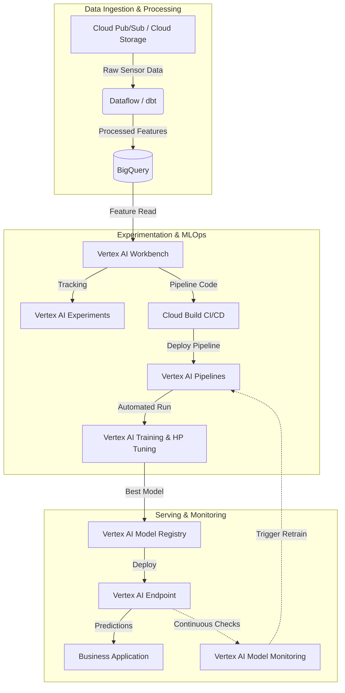

```mermaid
graph TD
    subgraph Data Ingestion & Processing
        A[Cloud Pub/Sub / Cloud Storage] -->|Raw Sensor Data| B(Dataflow / dbt)
        B -->|Processed Features| C[(BigQuery)]
    end

    subgraph Experimentation & MLOps
        C -->|Feature Read| D[Vertex AI Workbench]
        D -->|Tracking| E[Vertex AI Experiments]
        D -->|Pipeline Code| K[Cloud Build CI/CD]
        K -->|Deploy Pipeline| L[Vertex AI Pipelines]
        L -->|Automated Run| F[Vertex AI Training & HP Tuning]
    end

    subgraph Serving & Monitoring
        F -->|Best Model| G[Vertex AI Model Registry]
        G -->|Deploy| H[Vertex AI Endpoint]
        H -->|Predictions| I[Business Application]
        H -.->|Continuous Checks| J[Vertex AI Model Monitoring]
        J -.->|Trigger Retrain| L
    end
```